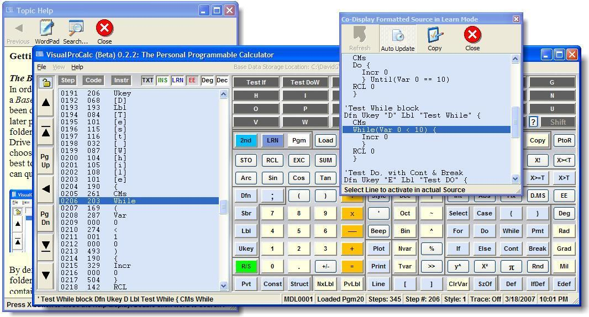



## VisualProCalc Advanced Programmable Calculator \(Public Release 1\.0\.0\)

### Description

VisualProCalc is not just a programmable calculator - it is THE Programmable Calculator. VisualProCalc has taken a major step forward in calculator technology. By leaps and bounds it goes beyond what any other programmable calculator can do. Unlike most other "programmable calculators" you may have seen, VisualProCalc is not just a simple program exploiting Microsoft's Scripting Runtime, nor does it, but it is in fact a full-fledged programming environment boasting a TREMENDOUS instruction set that employs advanced C-style programming rules. VisualProCalc is an extremely powerful and capable personal programmable calculator created for people wanting to learn how to design programs, for professionals seeking a commanding tool to solve the many complex problems they must constantly unravel in their work, and for people just wanting an inexpensive, yet extremely powerful calculator. VisualProCalc takes the features of the best programmable calculators and expands them. Unlike any other programmable calculator in existence, not only can you write, save, and load programs in VisualProCalc, but you can also construct huge Library Modules that can be loaded directly into VisualProCalc's memory, each individual library capable of storing up to 99 separate programs, with a maximum capacity of 990,000 program instructions. And accessing each program within these Library Modules is a breeze. Those programs can be used by themselves by other non-programmers, or they can easily be accessed by running other programs the user of the Library Module writes, or even by other programs within the Library Module themselves. VisualProCalc supports named variables and multi-dimensionality, support for complex logical comparisons, powerful logical operators, strong support of C language program logic-flow, full support for looping operations such as For loops, Do loops, Do...While loops, Do...Until loops, and While loops, simple or complex Switch blocks, If, If...Else, and If...ElseIf branching structures, Constants, and Structures. It has no limits in its parentheses or subroutine invocation depth, it supports Boolean flags and flag checking, variable increment and decrement, decrementing conditionals, statistical analysis, linear regressions, combinations, permutations, factorials, Polar/Rectangular conversion, number-base operation and conversion, extensive trigonometric functions, four angle bases (Degrees, Radians, Grads, and Mils), and angle conversions. It supports Sexagesimal functions, conditional compilation, labels, named subroutines, user-defined keys with displayed button labels and status bar help-tips, formatted program output display, extensive debugging and program tracing features. VisualProCalc not only supports 100 base variables, but each of these variables can also be dimensioned singly up to a 100 variable sub-array, or doubly into a 100 x 100 variable array matrix, providing a maximum prospective for up to 10,000 variable cells for each one of its 100 base variables (this is potentially 1 million variable storage locations). VisualProCalc supports 64-bit double precision floating-point values with 16 digits of accuracy, all displayable, plus 32-bit signed integers, 8-bit unsigned (character) integers, and variable-length text strings. VisualProCalc supports and can create as many multi-program Library Modules as you want for free, each supporting up to 99 programs (you can even lock these Library Modules if you wish to, to arrest prying eyes). VisualProCalc supports complex file input/output of up to 9 files, even simultaneously, plus access not only hard disc storage space, but to external storage devices, such as floppy disks, memory cards, and Flash or Jump Drives. This is not your Dad's programmable calculator from the late '70s when programmable calculators were king; this is the programmable calculator your Dad wished he had always had.
 
### More Info
 

             |
---                |---
**Submitted On**   |2007-04-03 13:52:30
**By**             |[David Ross Goben](https://github.com/Planet-Source-Code/PSCIndex/blob/master/ByAuthor/david-ross-goben.md)
**Level**          |Advanced
**User Rating**    |5.0 (214 globes from 43 users)
**Compatibility**  |VB 6\.0
**Category**       |[Complete Applications](https://github.com/Planet-Source-Code/PSCIndex/blob/master/ByCategory/complete-applications__1-27.md)
**World**          |[Visual Basic](https://github.com/Planet-Source-Code/PSCIndex/blob/master/ByWorld/visual-basic.md)
**Archive File**   |[VisualProC205825432007\.zip](https://github.com/Planet-Source-Code/david-ross-goben-visualprocalc-advanced-programmable-calculator-public-release-1-0-0__1-68164/archive/master.zip)

